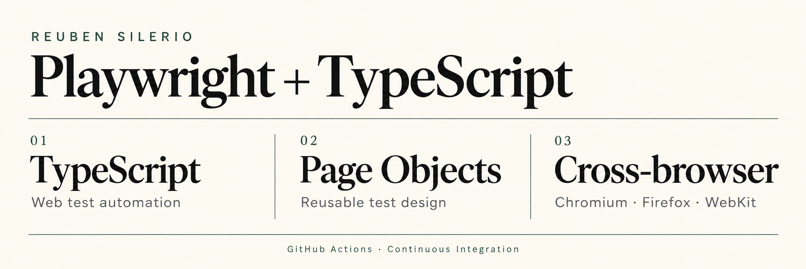

# Playwright + TypeScript
### Cross-browser QA automation portfolio

[](https://github.com/siler1o/QA-Playwright-TypeScript-Automation/actions/workflows/playwright.yml)


**A growing UI automation framework that turns documented test steps into repeatable browser checks.**

Built against [QA Playground](https://qaplayground.com), using reusable page objects, Playwright assertions, named test steps, and GitHub Actions.

[**View CI runs →**](https://github.com/siler1o/QA-Playwright-TypeScript-Automation/actions/workflows/playwright.yml) · [Test case](tests/TC001-input-fields.spec.ts) · [Page object](pages/InputFieldsPage.ts) · [Author](https://github.com/siler1o)

| Implemented coverage | Browser projects | Execution evidence |
| :--- | :--- | :--- |
| **TC001 · Input fields** | **Chromium · Firefox · WebKit** | **HTML report + retry traces** |

## What this project demonstrates

- **Page Object Model:** locators and reusable page interactions live in `InputFieldsPage`.
- **Readable test flow:** `test.step()` labels map the automated checks to TC001's steps.
- **State and behavior checks:** verify values, results, disabled state, keyboard focus, and readonly behavior.
- **Cross-browser execution:** the same test runs in three desktop browser projects.
- **Continuous integration:** GitHub Actions installs dependencies and browsers, runs the suite, and uploads its HTML report.

## Current test coverage

| TC001 steps | Interaction | Verification |
| :--- | :--- | :--- |
| 1–3 | Enter and submit `Interstellar` | Input value and submitted result match |
| 4–5 | Append ` Endgame`, then press Tab | `Avengers` becomes `Avengers Endgame` |
| 6 | Clear the prefilled field | Starts as `Inception`; becomes empty; confirmation appears |
| 7 | Check disabled input and tab navigation | Disabled state; Tab reaches readonly input without focusing disabled input |
| 8 | Read readonly value and attempt typing | Nonempty value, readonly attribute, and unchanged value after typing |

**Scope:** one test case with multiple named steps, run in three browser projects. These are desktop browser configurations, not physical-device tests. Buttons and other page coverage are future additions.

The Tab check currently allows up to eight presses from the Clear button to the readonly input. Changes to the practice page's focus order may require updating that check.

## Run locally

Install **Node.js 22** and Git, then run:

```powershell
git clone https://github.com/siler1o/QA-Playwright-TypeScript-Automation.git
cd QA-Playwright-TypeScript-Automation
npm.cmd ci
npx.cmd playwright install
npx.cmd playwright test
```

These commands use Windows PowerShell-compatible executable names. On macOS or Linux, use `npm` and `npx` instead of `npm.cmd` and `npx.cmd`. On Linux, install browser system dependencies with `npx playwright install --with-deps`.

| Task | PowerShell command |
| :--- | :--- |
| Run all configured browsers | `npx.cmd playwright test` |
| Run Chromium only | `npx.cmd playwright test --project=chromium` |
| Run TC001 | `npx.cmd playwright test tests/TC001-input-fields.spec.ts` |
| Show the browser during execution | `npx.cmd playwright test --project=chromium --headed` |
| Open the HTML report | `npx.cmd playwright show-report` |

Tests require internet access to the public practice website.

## GitHub Actions CI

The [workflow](.github/workflows/playwright.yml) runs on:

- Pushes to `main`.
- Pull requests targeting `main`.
- Manual execution using `workflow_dispatch`.

Each run checks out the code, sets up Node.js 22, installs locked dependencies with `npm ci`, installs Playwright browsers and system dependencies, and executes all configured browser projects.

| CI setting | Behavior |
| :--- | :--- |
| `forbidOnly` | Rejects accidentally committed `test.only()` |
| `retries` | Up to two retries for failed tests in CI; zero locally |
| `workers` | One worker in CI |
| `trace` | Captures the first retry for investigation |
| Report retention | HTML artifact retained for 14 days |

A test that passes only on retry is reported as flaky; a green job should still be reviewed for retries. CI executes tests and preserves reports; application deployment is not configured.

### Inspect a CI report

1. Open [Actions](https://github.com/siler1o/QA-Playwright-TypeScript-Automation/actions) and select a run.
2. Open the `test` job to inspect execution logs.
3. Return to the run summary and download the **playwright-report** artifact.
4. Extract the archive. From your local project, serve the extracted report folder:

```powershell
npx.cmd playwright show-report "C:\path\to\extracted\playwright-report"
```

Use the folder containing `index.html`. Reports are uploaded after test failures too, when generated and the workflow has not been canceled. Traces are available when a retry was executed.

## Project map

| Path | Purpose |
| :--- | :--- |
| [`pages/InputFieldsPage.ts`](pages/InputFieldsPage.ts) | Page locators, actions, and reusable assertions |
| [`tests/TC001-input-fields.spec.ts`](tests/TC001-input-fields.spec.ts) | Test orchestration and named verification steps |
| [`playwright.config.ts`](playwright.config.ts) | Base URL, browser projects, reports, and CI behavior |
| [`tsconfig.json`](tsconfig.json) | TypeScript settings and Node type definitions |
| [`.github/workflows/playwright.yml`](.github/workflows/playwright.yml) | Automated GitHub Actions execution |
| [`package-lock.json`](package-lock.json) | Locked dependency versions for repeatable installation |

Generated dependencies, reports, and test results are excluded from Git. The TypeScript configuration is version-controlled. The current workflow runs Playwright tests; it does not include a separate TypeScript type-checking step.

## Next steps

- Add TC002 Buttons using the documented test-case sequence.
- Expand page objects and assertions as new cases are implemented.
- Improve diagnostics and review reliability across all three browsers.

## More QA work

Built by **Reuben Silerio**, a QA Engineer with experience in web and mobile testing, release validation, and QA coordination.

[Profile](https://github.com/siler1o) · [Selenium + Python](https://github.com/siler1o/selenium-qa-automation-portfolio) · [Postman + Newman](https://github.com/siler1o/postman-api-testing-portfolio)
